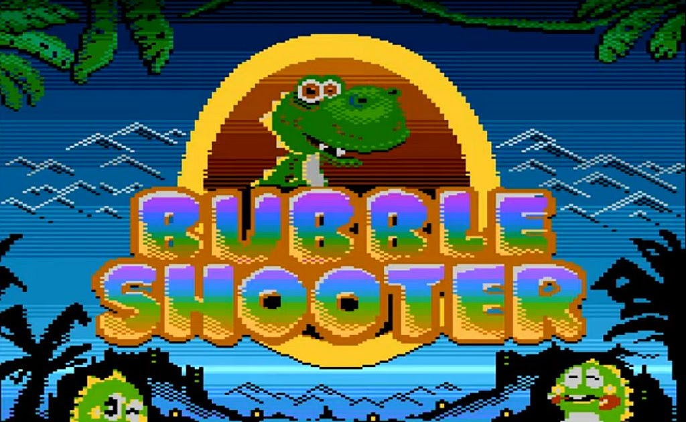

<h1><center><b># Bubble-Game</b></center>
<p align="center">
>>>>> This Game Main Motive is to improv your Concentration Power while working! <<<<<
---
</p>
<hr>
<h1># Bubble Game</h1>
<hr color="red" width="100%">
<p align="center">
  
</p>


<h2><b>## Description</b></h2>

<p align="center">
Bubble Game is a simple and addictive web-based game where players need to click on bubbles with numbers matching the given target number within a limited time frame. Each correct click increases the player's score, while incorrect clicks or running out of time leads to game over. The game is designed to test players' reflexes and concentration within a challenging time limit.
</p>
<hr color="yellow" width="100%">
<h2><b>## Technologies Used</b></h2>

<p>
- **HTML:** The game interface is created using HTML to structure the elements on the webpage.<br>
- **CSS:** CSS styles are applied to enhance the visual appeal and layout of the game interface.<br>
- **JavaScript:** The game logic and functionalities are implemented using JavaScript, including generating bubbles, updating scores, handling click events, and running the timer.<br>
</p>
<hr color="blue" width="100%">

<h2><b>## Functionalities</b></h2>

- **Score Tracking:** The game keeps track of the player's score, increasing it with each correct bubble click.
- **Timer:** A countdown timer limits the duration of the game session, adding a sense of urgency and challenge.
- **Dynamic Bubble Generation:** Bubbles with random numbers are generated dynamically on the game panel, providing varied gameplay experiences.
- **Target Number Generation:** A target number is generated for each round, indicating the number that the player needs to click on to earn points.
- **Game Over Handling:** The game ends when the timer reaches zero, displaying a game over message along with the final score.
- **Responsive Design:** The game interface is responsive, ensuring optimal display and functionality across different devices and screen sizes.
<hr color="orange" width="100%">

<h2><b>## How to Play</b></h2>

<p>
1. When the game starts, bubbles containing random numbers appear on the game panel.<br>
2. The "Hit" number displayed at the top indicates the target number that the player needs to click on.<br>
3. Click on a bubble with a number matching the "Hit" number to earn points.<br>
4. Keep clicking on matching bubbles to increase your score before the timer runs out.<br>
5. The game ends when the timer reaches zero. Your final score is displayed, indicating your performance in the game.<br>
</p>
<hr color="green" width="100%">

<h2><b>## Demo</b></h2>

<h3><i><b><u>DEMO:</u></b></i></h3> <a href="https://blocknotes-4515.github.io/Bubble-Game/">Let's PLAY THE GAME THEN CLICK HERE!</a>
<div style="display: flex; justify-content: space-between;">
  
  
</div>


<h2><b>## Installation</b></h2>
<p align="center">
1. Clone the repository to your local machine.
   ```
   git clone https://github.com/yourusername/bubble-game.git
   ```
2. Open the `index.html` file in your web browser to start playing the game.
</p>
<hr color="purple" width="100%">

<h2><b>## Contributions</b></h2>
<p align="center">
Contributions to the Bubble Game project are welcome! If you have any ideas for improvements, bug fixes, or new features, feel free to submit a pull request or open an issue on GitHub.
</p>

<h2><b>## License</b></h2>
<p align="center">
This project is licensed under the <a href="https://drive.google.com/file/d/1cwp2tO6gvFL62ZbQB4nPjYd5l2LOe2b1/view?usp=sharing">MIT LICENCE @Copyright 2024 DD Coorporations.</a>

---

Feel free to customize and expand upon this README template to provide more detailed information about your Bubble Game project. Good luck with your project and happy gaming!</p>
<hr color="green" width="100%">
